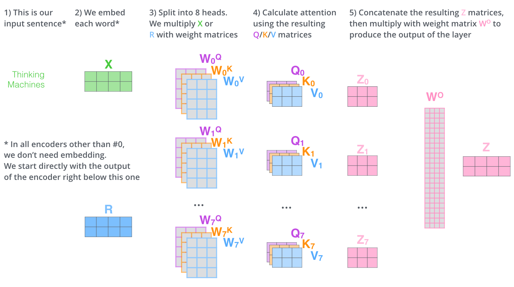
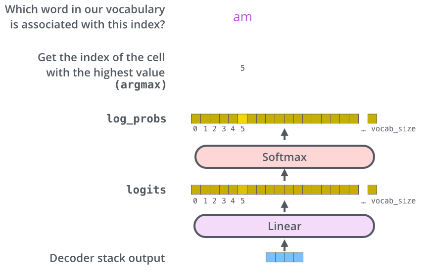

# 【译】图解 Transformer

> 原文 [The Illustrated Transformer](https://jalammar.github.io/illustrated-transformer/) 
> 译者：[GFeather](https://github.com/GFeather)

# 图解 Transformer

 [在之前的博文里，我们介绍了注意力机制](https://jalammar.github.io/visualizing-neural-machine-translation-mechanics-of-seq2seq-models-with-attention/) - 一种在现代深度学习模型中很普遍的方法。 Attention 是一个提升自然语言处理应用性能的概念。在这篇文章中，我们将会介绍 **Transformer** - 一个使用注意力机制加快训练速度的模型。在特定的任务上Transformer优于Google机器翻译模型。然而，最大的好处来自于Transformer如何为并行化做出贡献。事实上，Google Cloud建议使用The Transformer作为参考模型来使用他们的 [Cloud TPU](https://cloud.google.com/tpu/) 产品。所以让我们通过模型的内部结构来看它是怎么工作的。

Transformer在论文 [Attention is All You Need](https://arxiv.org/abs/1706.03762)  中被发布。在 [Tensor2Tensor](https://github.com/tensorflow/tensor2tensor)包中可以看到TensorFlow实现。

哈佛大学的NLP小组创建了一个用PyTorch实现注释论文的[指南](http://nlp.seas.harvard.edu/2018/04/03/attention.html)。在这篇文章中，我会试着让事情变简单点并逐一介绍这些概念让没有专业背景的人能很容易就能理解。

### 概述

首先让我们把这个模型看做一个黑箱。在机器翻译应用中，它接收一种语言的语句，将它翻译为另一种语言。	

打开这个神奇的机器，我们看到一个编码组件、一个解码组件，以及他们之间的联系。

编码模块由多个编码器堆叠在一起(图中有六个编码器互相堆叠， 只是图中有六个)。解码模块也是由一系列解码器堆叠组成。

这些编码器在结构上是完全相同的(但是他们不共享权重)。每一个都分为两个子层：

编码器的输入流首先经过一个   self-attention   层 - 使编码器在处理文本中的单词时能够获取其他单词的信息。我们会在下面更详细地介绍   self-attention   机制。

   self-attention   层的输出将会进入反馈神经网络。反馈神经网络会对每个权重都产生影响。

解码器也有这样两层网络，但是在这两层之间还有一个  Attention  层来使解码器关注输入语句的相应部分(类似于 [seq2seq](https://jalammar.github.io/visualizing-neural-machine-translation-mechanics-of-seq2seq-models-with-attention/) 模型的  Attention  )。

### 将张量引入图片

接下来是模型的主要部分，让我们开始研究各种向量/张量，以及它们如何在这些组件之间流动，从而将经过训练的模型的输入转换为输出。

首先是NLP应用中普遍的操作，使用 [embedding](https://medium.com/deeper-learning/glossary-of-deep-learning-word-embedding-f90c3cec34ca) 算法把输入的词语转化成向量

> ​		每个单词都 embedding 到大小为512的向量中。我们将用这些简单的框表示这些向量

embedding 只发生在最底层的编码器。所有编码器接收的都是一个包含大小为512的向量的向量列表 - 在底层编码器作为单词的 embedding，但是在其他编码器作为编码器的输出。这个列表的长度可以通过超参数来这顶 - 一般被设置为训练集中最长的句子的长度。

输入序列中的单词 embedding 之后会流过编码器的两层网络。

接下来我们来看 Transformer 的核心属性，流过编码器的每一个单词都有独立的权重。   self-attention   层的权重之间存在依赖关系。 feed-forward 层中的权重不互相依赖，因此数据流经 feed-forward 层时可以并行计算。

Next，我们选择一个简短的句子来解释编码器的每个子层是怎么运作的。

### 现在开始编码!

正如我们提到的，一个编码器接收一个向量列表作为输入。通过把这些向量放入 ‘self-attention’  层来处理这个列表，随后进入反馈神经网络，之后输出到上层编码器。

### Self-Attention 概述

不要因为这里出现了很多 “self-attention” 就觉得每个人都应该熟悉这个概念。在我读过论文 Attention is All You Need 之前从来没听过这个概念。后面详细介绍它是怎么工作的。

把后面这句我们想翻译的句子作为输入：

”`The animal didn't cross the street because it was too tired`”

这句话中 “it” 指什么？它指代街道还是动物？对人类来说这是个很简单的问题 ，但是对于一个算法来说并不简单。

当模型在处理 “it” 这个单词时，self-attention 将会把 “it” 和 “animal” 联系在一起。

当模型处理每个单词时( 输入序列的每个位置 )， 为了更好地编码这个单词 self-attention 会把它跟输入序列中其他位置联系起来来获得更多信息。

如果你很熟悉RNN，那应该清楚在处理当前单词时隐藏层是怎么获取处理过的单词的信息。Self-attention 是 Transformer 用来将其他相关词语的“理解”转化为我们目前正在处理的词语的方法。

在 [Tensor2Tensor notebook](https://colab.research.google.com/github/tensorflow/tensor2tensor/blob/master/tensor2tensor/notebooks/hello_t2t.ipynb) 中可以加载 Transformer 模型，以及使用可视化方法来检测结果。

### 细说 Self-Attention 

首先介绍使用 向量怎么计算 self-attention ，然后实际中怎么使用矩阵实现。

计算 self-attention 的**第一步**是根据编码器的输入向量( 每个单词 embedding 的结果 )创建三个向量。对于每一个输入向量，我们分别创建 Query 向量、Key 向量、Value 向量。这些向量是用 embedding  结果乘以训练过程中训练出来的三个矩阵得到的。

值得注意的是最后得到的向量维度比  embedding 向量小。它的维度为64， embedding 和编码器输入/输出向量的维度都为512.他们并没有变小，这只是一种架构选择使得 multiheaded attention ( 大多数 ) 的计算保持不变。

> X~1~ 乘以 权重矩阵WQ 得到 q~1~ , 即与词向量相关的"query" 向量。最后我们得到输入序列中每个单词的 "query", "key", "value" 投影。

 "query", "key", "value" 向量是什么？

它们是为了帮助计算和理解 attention 设计的抽象。接下来你会读到怎么计算 attention，并且弄清楚这三个向量到底扮演什么角色。

计算 self-attention 的**第二步**是计算分值。这里我们计算第一个单词的 self-attention作为示例，“Thinking”。我们需要根据这个词对输入文本的每个单词进行评分。这个分数代表我们在处理一个单词时对输入文本的其他部分的注意力是多少。

每个单词的分数是通过 query 向量和 key 向量点乘得到的。所以我们如果要计算位置为#1的单词的 self-attention，score~1~ = q~1~ ***dot*** k~1~ ( 点乘 ) ,score~2~ = q~1~ ***dot*** k~2~ 。

**第三、四步**为将 score 除以8 ( 本文的 key 向量使用的维度 - 64 的平方根。这会让梯度更稳定。这里可以使用其他值，这里使用的是默认值)，然后结果经过 softmax 操作。Softmax 归一化之后的分数都为正且和为1。

这个 softmax分数 代表每个单词在这个位置表达的信息量。显然这个位置的单词的 softmax分数 是最高的，但是它能够有效地把当前单词与相关联的其他单词联系起来。

**第五步**是用 softmax分数 乘以 Value 向量( 准备对它们求和 )。主要是为了保证这些单词信息的完整性，并去掉不相关的单词( 通过乘以一个非常小的数字，比如0.001 )。

**第六步**是与 Value 向量相加。这就是 self-attention 层的输出( 第一个单词对应的输出 )。

这就是 self-attention 的计算过程。我们可以把这个结果向量发送给反馈神经网络。然而在具体实现中，为了加快速度，这个计算使用矩阵形式进行。现在我们从单词层面来探究计算思想。

### Self-Attention 的矩阵运算

**第一步**是计算 Query、Key 和 Value 矩阵。我们将嵌入的数据组装成矩阵 X，然后乘以我们训练出来的权重 矩阵(  WQ、WK、WV )。

> X 矩阵的每一行都对应属于语句中的一个单词。在这可以看到词向量和*q\k\v*大小的不同( 词向量512维 图中4方格、*q\k\v* 64维 图中3方格)

**最后**，我们来处理矩阵，我们用 一个公式将两步组合在一起来计算 self-attention 层的输出。

### 多头巨兽

通过引入 “multi-headed” 注意力机制，进一步增强了 self-attention 层。可以通过两种方式来提升 attention 层的性能：

1. 通过关注不同位置来扩展模型能力。比如，z1 包含一点其他编码，但是它可以被单词本身所控制。如果我们翻译一个句子它会很有效，比如 “ The animal didn’t cross the street because it was too tired ”，我们会想知道 “it” 指代什么。
2. 它能够使 attention 层具有多重 “抽象子空间”。接下来我们会详细介绍，我们不只有一个 multi-headed attention，而是有多个 Query\Key\Value 权重矩阵集合( Transformer 使用八个attention，所以每个encoder\decoder最后会得到八个结果集 )。这些集合都会随机初始化。通过训练，这些集合会在不同的向量子空间作用在输入的词向量上。

> 在 multi-headed attention 下，我们为每个head单独维护一个 Q\K\V 权重矩阵，从而产生不同的 Q\K\V 矩阵。在做这些之前，通过用 X 乘以 WQ\WK\WV 矩阵来得到  Q\K\V矩阵。

如果我们使用前面介绍的 self-attention 计算方法在不同的权重矩阵下计算八次，最后我们会得到八个不同的 Z 矩阵。

这让我们遇到了一点小困难。 feed-forward 层的输入是一个矩阵而不是八个矩阵。所以我们需要把这八个矩阵组合成单个矩阵。

我们该怎么做？把这八个矩阵拼接起来然后乘以额外的特征矩阵 WO。

这些就是 multi-headed self-attention。确实是很难搞的一堆矩阵，我觉得。让我们把它们放到一张图里看看。

既然我们已经摸到了点 attention heads 的门道，那么让我们重新回顾一下以前的例子，看看在我们的示例句中，当我们编码“it”这个词时，不同的注意力集中在哪里：

> 在我们编码“it”这个词时，其中一个 attention head 注意力集中在 “ the animal ”上，另一个集中在“ tired “上--从某种意义上说，这个模型对” it “的表示在“ animal “和” tired “中都有体现。

但是我们将所有 attention heads 放到一起就很难解释了：

### 使用位置编码表示序列的顺序

我们介绍的模型还缺少解释单词在输入序列中顺序的方法。

为了解决这个问题，Transformer 给每个输入的词向量加上了一个向量。这些向量遵循模型学习的特定模式，用来帮助确定单词的位置，或者序列中不同单词的差异性。这里是想在词向量映射到 Q\K\V 向量和做 attention 点乘时提供一个有意义的词向量间的距离。

> 为了让 模型能感知单词的顺序，我们增加了定位编码向量 -- 它的值遵循特定模式。

假定词向量的维数是4，那么实际的定位编码就是这样：

那么这个模式是什么？

在下面的图片里，每一行都对应一个向量的定位编码。所以这里第一个向量会加到输入序列的第一个单词的词向量上。每一行包含512个范围在1 到 -1之间的值。下面通过颜色编码可视化了这个模式。 

> 这里是20个词向量为512维的单词的定位编码的真实例子，图像看起来像是从中心向下一分为二。这是因为左右分别使用不同的函数生成( 左sine、右cosine )。图像由所有定位编码向量拼接而成。

定位编码的生成公式在文章中也有描述( 3.5节 )。生成定位编码的代码在 [`get_timing_signal_1d()`](https://github.com/tensorflow/tensor2tensor/blob/23bd23b9830059fbc349381b70d9429b5c40a139/tensor2tensor/layers/common_attention.py)。这也不是唯一生成定位编码的方法。不过这个方法能够处理不定长的序列( e.g. 比如我们的模型去翻译一个比训练集中所有句子都长的句子 )。

### 残差

在这之前，这个编码器的架构中有一个细节需要注意，编码器中的每个子层都有一个连接在 [layer-normalization](https://arxiv.org/abs/1607.06450) 上的额外连接。

下图可视化了向量和 layer-norm 操作与 self-attention 之间的关系：

下图是两层编码器\解码器的 Transformer 的编码器结构图：

### 解码阶段

现在我们已经介绍了编码器的大部分概念，了解解码器的基本作用。现在我们来看他们是怎么协同工作的。

首先编码器处理输入序列。最顶端编码器的输出会转换为一组 attention 向量 K\V。解码器的“ encoder-decoder attention ”用他们来让解码器关注输入序列的适当部分：

> 完成编码阶段之后就会开始解码阶段。解码器每步从输出序列中输出一个元素。

接下来就是重复处理直到 transformer 解码器输出处理完成的特殊符号。每一步的输出会在下一步进入解码器，解码器会像编码器那样讲解码结果冒泡弹出。就像处理编码器输入一样，我们也会给解码器输入嵌入并添加位置编码来指示单词位置。

解码器中的 self-attention 层与编码器中有一些不同：

在解码器中，self-attention 层只关注输出序列中前一个位置。这是通过在 self-attention 计算的 softmax 之前屏蔽未来的位置来实现的( 设置为 -inf )。

 “Encoder-Decoder Attention” 层运行机制与 multiheaded self-attention 相同，除了它会在下面的层中生成 Queries 矩阵，并从编码器堆栈的输出中获取 Key\Value 矩阵。

### The Final Linear and Softmax Layer

解码器堆栈的输出是一个浮点数向量。怎么把它转换成单词？这是 softmax 层之后的 Linear 层的工作。

Linear 层是一个简单的全连接神经网络，它将解码器堆栈产生的向量投影到一个更大的向量中，称作逻辑向量。

现在我们假设我们的模型从训练集中学习到了10,000个不同的单词。那么就会产生一个10,000维大小的逻辑向量 - 每个维对应一个单词的分数。这就是模型中 Linear 层输出的含义。

然后 softmax 层把这些分数转换为概率( 全为正且和为1 )。概率最高的单词就是这一步的输出。

> 上图从底部的解码器输出向量开始，最后输出结果单词。

### 回顾训练

我们已经通过训练一个 Transformer 来介绍正向处理流程，接下来我们来介绍训练模型的思想。

在训练时，未训练的模型会经过完全相同的处理过程。但是在一个有标签的训练集上训练时，我们就可以用输出和真实结果做对比。

假设输出的词汇只包含六个单词( “a”, “am”, “i”, “thanks”, “student”, and “<eos>” ( ‘end of sentence’)的缩写 )，如下图：

> 模型的词汇表在我们训练之前已经创建

我们定义了输出词汇表之后，就可以用一个向量来表示词汇表中的单词。这被称做 one-hot 编码。比如，我们可以用下面这个向量来表示“ am ”：

重新回顾之后让我们来探讨模型的损失函数 - 在训练期间不断优化这个数值来获得更精确的模型。

### 损失函数

在训练我们的模型时，确定损失函数是第一步，我们这里训练一个将“ merci ”翻译为“ thanks ”的简单模型。

这意味着输出的概率分布表示的结果为“ thanks ”。但是现在还没有训练出这个模型。

> 随机初始化模型权重之后产生的概率分布下每个单词的值都是任意的。我们可以与真实输出作对比，通过反向传播算法逐渐调整模型来逼近我们想要的结果。

怎么来比较两个概率分布？简单地将它们相减。如果想了解更多细节，参阅 [cross-entropy](https://colah.github.io/posts/2015-09-Visual-Information/) 和  [Kullback–Leibler divergence](https://www.countbayesie.com/blog/2017/5/9/kullback-leibler-divergence-explained)

但是这个例子太过简单了。为了更加真实，我们用一个句子来举例。e.g. : input: “je suis étudiant” ouput : “i am a student”。也就是说，我们希望模型依次输出概率分布，其中：

- 每个概率分布用大小为 vocab_size 的向量来表示( 这里用6来举例，现实中一般为3,000 到10,000 )
- 第一个概率分布中概率最高的格子对应单词 “ I ”
- 第二个概率分布中概率最高的格子对应单词 “ am ”
- 直到第五个概率分布表示 ‘`<end of sentence>`’，每个位置都能从10,000个元素的词汇表中找到对应的单词。

> 这是我们想要从例句中得到的概率分布

通过一个海量数据集用足够的时间训练出模型后，我们希望得到以下这样的概率分布：

> 我们希望通过训练模型能够输出我们想要的翻译。当然，如果这个单词就在我们的数据集中，那么这不一定是我们想要的结果( see: [交叉验证](https://www.youtube.com/watch?v=TIgfjmp-4BA) )。需要注意的是每个位置都会有一定的概率，即便它不可能是最终输出 -- softmax 的这个属性在训练过程中非常有用。

因为模型每次只产生一个输出，所以我们可以假设模型每次回选择概率最高的那个结果然后把其他的丢掉。其中一个可以实现的方法是( 贪心编码 )。 另一个方法是每次抓取两个概率最高的两个单词( e.g. : " I " 和 " me " )，然后运行这个模型两次 : 第一次假定这个位置的输出是 " I ", 另一次假定它为 " me ",	综合位置#1 和 #2 留下误差小的那一个。在位置#2 和 #3 重复这个步骤...以此类推。这个方法叫做" beam search"，前面的例子中 beam_size 是2( 因为我们在计算之后综合位置#1 和 #2 做对比)，top_beams 也是2( 因为我们取概率top2的单词 )。这些都是可以调节的超参数。

### 更进一步

我希望你能够找到一个优质博客\论坛去学习 Transformer。如果你想深入了解，推荐你阅读以下文章：

- 提出 Attention 的论文  [Attention Is All You Need](https://arxiv.org/abs/1706.03762)，关于 Transformer 的博文 ( [Transformer: A Novel Neural Network Architecture for Language Understanding](https://ai.googleblog.com/2017/08/transformer-novel-neural-network.html) )，以及 [Tensor2Tensor announcement](https://ai.googleblog.com/2017/06/accelerating-deep-learning-research.html)。
-  [Łukasz Kaiser’s talk](https://www.youtube.com/watch?v=rBCqOTEfxvg) 这篇文章会深入模型的细节
-  [Jupyter Notebook provided as part of the Tensor2Tensor repo](https://colab.research.google.com/github/tensorflow/tensor2tensor/blob/master/tensor2tensor/notebooks/hello_t2t.ipynb) 这是一个可用的实例
-  [Tensor2Tensor repo](https://github.com/tensorflow/tensor2tensor) 

拓展资料：

- [Depthwise Separable Convolutions for Neural Machine Translation](https://arxiv.org/abs/1706.03059)
- [One Model To Learn Them All](https://arxiv.org/abs/1706.05137)
- [Discrete Autoencoders for Sequence Models](https://arxiv.org/abs/1801.09797)
- [Generating Wikipedia by Summarizing Long Sequences](https://arxiv.org/abs/1801.10198)
- [Image Transformer](https://arxiv.org/abs/1802.05751)
- [Training Tips for the Transformer Model](https://arxiv.org/abs/1804.00247)
- [Self-Attention with Relative Position Representations](https://arxiv.org/abs/1803.02155)
- [Fast Decoding in Sequence Models using Discrete Latent Variables](https://arxiv.org/abs/1803.03382)
- [Adafactor: Adaptive Learning Rates with Sublinear Memory Cost](https://arxiv.org/abs/1804.04235)

### 鸣谢

感谢 [Illia Polosukhin](https://twitter.com/ilblackdragon), [Jakob Uszkoreit](http://jakob.uszkoreit.net/), [Llion Jones ](https://www.linkedin.com/in/llion-jones-9ab3064b), [Lukasz Kaiser](https://ai.google/research/people/LukaszKaiser), [Niki Parmar](https://twitter.com/nikiparmar09), and [Noam Shazeer](https://dblp.org/pers/hd/s/Shazeer:Noam)为早期版本提供了宝贵意见。

也欢迎你随时到我的 [Twitter](https://twitter.com/jalammar) 上反馈问题。

*Written on June 27, 2018*

